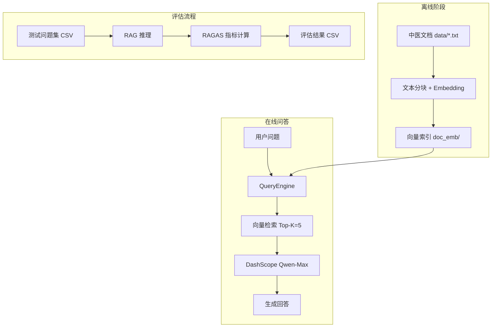
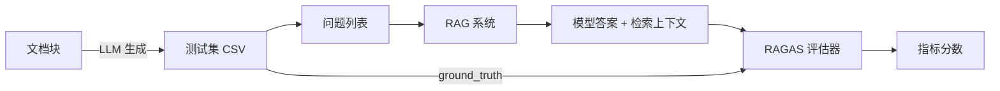

# 中医临床诊疗智能助手 — 项目说明

> 主程序：`new_zhongyi_agent.py`  
> 基于 **RAG（检索增强生成）** 的中医证候知识问答系统，支持 Web 交互与 RAGAS 自动化评估。

---

## 目录

1. [项目概述](#1-项目概述)
2. [系统架构](#2-系统架构)
3. [目录结构](#3-目录结构)
4. [技术栈](#4-技术栈)
5. [环境准备与安装](#5-环境准备与安装)
6. [快速开始](#6-快速开始)
7. [功能详解](#7-功能详解)
8. [RAGAS 测试方法](#8-ragas-测试方法)
9. [评估指标说明](#9-评估指标说明)
10. [输出文件说明](#10-输出文件说明)
11. [命令行参数一览](#11-命令行参数一览)
12. [知识库构建（索引）](#12-知识库构建索引)
13. [常见问题](#13-常见问题)
14. [与旧版 zhongyi_agent.py 的区别](#14-与旧版-zhongyi_agentpy-的区别)
15. [边界与免责声明](#15-边界与免责声明)

---

## 1. 项目概述

本项目是一个面向**中医证候领域**的智能问答系统。核心思路是：将中医临床文档（如证候定义、辨证要点）向量化存入本地索引，用户提问时先**检索**相关文档片段，再交由大语言模型**生成**回答，从而减轻模型幻觉、补充垂域知识。

### 主要能力

| 能力 | 说明 |
|------|------|
| 向量检索问答 | 从 `doc_emb/` 持久化索引中检索 Top-5 相关片段，结合 Qwen-Max 生成回答 |
| Web 交互界面 | 基于 Gradio 的聊天式 UI，本地浏览器访问 |
| RAGAS 自动评估 | 自动生成或加载测试集，量化评估 RAG 质量 |
| 按需加载 | 评估相关依赖仅在 `--eval` / `--eval-only` 时加载，Web UI 启动更轻量 |

### 适用场景

- 中医证候、辨证论治相关知识的查询与辅助学习
- RAG 系统搭建、Prompt 调优、检索参数对比实验
- 课程作业或 POC 演示

---

## 2. 系统架构

### 2.1 整体流程



### 2.2 RAG 问答链路

1. **加载索引**：从 `doc_emb/` 读取已持久化的向量索引
2. **向量检索**：将用户问题嵌入，检索语义最相近的 5 个文档块（`similarity_top_k=5`）
3. **Prompt 组装**：将检索到的上下文填入中文 QA 模板
4. **LLM 生成**：调用 DashScope **Qwen-Max** 生成最终回答
5. **Refine（可选）**：多片段场景下，使用 refine 模板逐步优化答案

### 2.3 核心模块

| 模块 | 函数/类 | 职责 |
|------|---------|------|
| 模型配置 | `configure_models()` | 初始化 DashScope LLM 与 Embedding |
| 查询引擎 | `load_query_engine()` / `get_query_engine()` | 加载索引、设置 Prompt、构建 QueryEngine |
| Web UI | `run_web_ui()` | Gradio 聊天界面 |
| QA 生成 | `generate_evaluation_dataset()` | 从文档块自动生成测试问答对 |
| RAG 推理 | `run_rag_predictions()` | 批量调用 RAG 获取答案与检索上下文 |
| RAGAS 评估 | `evaluate_with_ragas()` | 计算 Faithfulness 等 5 项指标 |
| LangChain 适配 | `get_ragas_models()` | 将 DashScope 模型适配为 RAGAS 可用格式 |

---

## 3. 目录结构

```
AI-Powered TCM Diagnostics/
├── new_zhongyi_agent.py      # 主程序：Gradio / RAGAS CLI
├── backend/                  # FastAPI 与平台模块（见 tcm-diagnostics-platform SKILL）
│   ├── app.py                # FastAPI 入口
│   ├── config.py             # 环境变量
│   ├── server.py             # /api/v1 路由
│   ├── rag.py                # RAG 网关（复用 get_query_engine）
│   ├── security.py           # 主题 / HITL / PII
│   ├── observability.py      # request_id + JSONL
│   └── logs/runs.jsonl       # 运行审计（运行时生成）
├── scripts/
│   ├── start.sh              # 启动 FastAPI（8090）
│   └── security_check.sh     # pip-audit + bandit
├── security.py               # 兼容 re-export → backend.security
├── observability.py          # 兼容 re-export → backend.observability
├── zhongyi_agent.py          # 旧版程序
├── boundary-checklist.md
├── project-blueprint.md
├── contracts/rag_response.schema.json
├── requirements.txt
├── 项目说明.md
│
├── data/demo.txt
├── doc_emb/
├── index_api.ipynb
├── rag_eval_dataset.csv
└── ragas_evaluation_results.csv
```

---

## 4. 技术栈

| 类别 | 技术 | 用途 |
|------|------|------|
| RAG 框架 | LlamaIndex | 索引加载、检索、QueryEngine |
| 大模型 | DashScope Qwen-Max | 问答生成、QA 对生成、RAGAS 判分 |
| 向量模型 | DashScope text-embedding-v1 | 文档与问题向量化 |
| Web UI | Gradio 4.x / 6.x | 本地 Web 聊天界面 |
| HTTP API | FastAPI + uvicorn | `/api/v1/queries` / health / stats（8090） |
| 评估框架 | RAGAS | 自动化 RAG 质量评估 |
| 数据工具 | pandas、datasets | CSV 读写、评估数据集 |
| LLM 适配 | langchain-core | RAGAS 所需的 LangChain 接口 |

---

## 5. 环境准备与安装

### 5.1 前置条件

- Python 3.10+（推荐 3.11）
- 阿里云 DashScope API Key（[开通地址](https://dashscope.aliyun.com/)）
- 已构建好的向量索引目录 `doc_emb/`（见[第 12 节](#12-知识库构建索引)）

### 5.2 安装依赖

```bash
cd 中医问诊系统
pip install -r requirements.txt
```

### 5.3 配置 API Key

```bash
export DASHSCOPE_API_KEY='你的密钥'
```

建议写入 `~/.zshrc` 或 `~/.bashrc` 以便持久生效。

### 5.4 验证安装

```bash
python -c "import gradio, llama_index; print('依赖 OK')"
```

---

## 6. 快速开始

### 启动 Web 问答界面（默认）

```bash
python new_zhongyi_agent.py
```

浏览器访问：**http://127.0.0.1:7860**

### 启动 FastAPI（与 SKILL 一致）

```bash
export DASHSCOPE_API_KEY='你的密钥'
./scripts/start.sh
# 或: python -m uvicorn backend.app:app --host 127.0.0.1 --port 8090
```

- 健康检查：`GET http://127.0.0.1:8090/api/v1/health`
- RAG 问答：`POST http://127.0.0.1:8090/api/v1/queries`（body: `{"question":"..."}`）
- OpenAPI 文档：`http://127.0.0.1:8090/docs`

Gradio（7860）与 FastAPI（8090）可并存；审计统一写入 `backend/logs/runs.jsonl`。

示例问题：

- 不耐疲劳，口燥，咽干可能是哪些证候？
- 血热挟湿证的临床表现有哪些？

### 首次运行 RAGAS 完整评估

```bash
python new_zhongyi_agent.py --eval
```

### 复用已有测试集快速评估

```bash
python new_zhongyi_agent.py --eval-only
```

---

## 7. 功能详解

### 7.1 Web 问答模式

**触发方式**：无参数、`--webui`

**工作流程**：

1. 校验 `DASHSCOPE_API_KEY`
2. 加载 DashScope LLM / Embedding
3. 从 `doc_emb/` 加载向量索引
4. 启动 Gradio 服务（默认 `127.0.0.1:7860`）
5. 用户输入问题 → RAG 检索 + 生成 → 返回答案

**Prompt 策略**：

- **QA 模板**：要求模型严格依据上下文回答，无相关信息时明确说明
- **Refine 模板**：多文档块时逐步优化答案

**兼容性处理**：

- 自动设置 `NO_PROXY`，避免 HTTP 代理导致 Gradio 启动失败
- 兼容 Gradio 3.x / 4.x / 6.x 的 Chatbot 消息格式

### 7.2 完整评估模式（`--eval`）

三步流水线：

```
步骤 1：生成评估数据集（rag_eval_dataset.csv）
    ↓ 从索引随机抽取文档块，LLM 生成 QA 对
步骤 2：RAG 批量推理
    ↓ 对每个问题检索 + 生成答案
步骤 3：RAGAS 评估
    ↓ 计算 5 项指标，输出 ragas_evaluation_results.csv
```

### 7.3 快速评估模式（`--eval-only`）

跳过步骤 1，直接读取已有 CSV 执行步骤 2 和 3。

适用场景：

- 调整 `similarity_top_k`、Prompt 模板后对比效果
- 更换 Embedding 模型后复测
- 节省 API 调用费用（不再重复生成 QA 对）

---

## 8. RAGAS 测试方法

### 8.1 测试流程总览



### 8.2 方式一：完整评估（推荐首次使用）

```bash
# 生成 10 条 QA 对并评估（默认）
python new_zhongyi_agent.py --eval

# 生成 20 条 QA 对
python new_zhongyi_agent.py --eval --num-questions 20
```

**输出**：

- `rag_eval_dataset.csv` — 测试集
- `ragas_evaluation_results.csv` — 评估结果
- 终端打印汇总均分与逐题明细

### 8.3 方式二：复用已有测试集（推荐调参对比）

```bash
# 使用默认测试集 rag_eval_dataset.csv
python new_zhongyi_agent.py --eval-only

# 使用自定义测试集
python new_zhongyi_agent.py --eval-only --dataset my_test.csv
```

### 8.4 测试集 CSV 格式

| 列名 | 是否必需 | 说明 |
|------|----------|------|
| `question` | **必需** | 测试问题 |
| `ground_truth` | 二选一 | 标准答案 |
| `answer` | 二选一 | 标准答案（与 ground_truth 等价） |
| `context` | 可选 | 生成时的源文档块，RAGAS 评估不直接使用 |

**示例**：

```csv
question,ground_truth,context
血热挟湿证的临床表现有哪些？,斑疹显露，疹色暗红或紫黑...,（源文档片段）
表虚证的特征是什么？,淅淅畏风，动辄汗出...,（源文档片段）
```

也可手动编写 CSV，用于针对性测试：

```csv
question,answer
什么是表寒证？,因风寒侵袭肌表所致，临床以恶寒重、发热轻，无汗...
```

### 8.5 测试集自动生成原理

1. 从 `doc_emb` 索引的 docstore 中获取所有文档块（节点）
2. 随机抽取 N 个节点（默认 10 个）
3. 对每个节点，调用 Qwen-Max 生成 JSON 格式的 `{question, answer}`
4. 解析 JSON 并写入 CSV

若索引节点不可用，会回退读取 `data/*.txt` 原始文档。

### 8.6 如何解读测试结果

**看汇总均分**（终端输出）：

```
faithfulness: 0.8523
answer_relevancy: 0.9102
context_precision: 0.7845
context_recall: 0.8012
answer_correctness: 0.8234
```

**看逐题明细**（`ragas_evaluation_results.csv`）：

- 找出得分最低的题目，分析是检索问题还是生成问题
- 对比 `answer` 与 `ground_truth` 的差异
- 检查 `contexts` 列中检索到的片段是否包含关键信息

**调参对比建议**：

1. 首次 `--eval` 生成固定测试集
2. 修改 Prompt 或 `similarity_top_k`
3. 反复 `--eval-only` 对比 `ragas_evaluation_results.csv` 均分变化

### 8.7 调试模式

```bash
# 查看 LlamaIndex 完整调用 trace（检索、Prompt、LLM 输入输出）
python new_zhongyi_agent.py --debug
python new_zhongyi_agent.py --eval-only --debug
```

或通过环境变量：

```bash
export ZHONGYI_DEBUG=1
python new_zhongyi_agent.py --eval-only
```

---

## 9. 评估指标说明

RAGAS 五项指标，分数范围一般为 **0 ~ 1**，越高越好。

| 指标 | 英文名 | 衡量什么 | 低分常见原因 |
|------|--------|----------|--------------|
| 忠实度 | `faithfulness` | 答案是否基于检索上下文，有无编造 | Prompt 约束不足、上下文噪音大 |
| 答案相关性 | `answer_relevancy` | 答案是否切题 | 检索偏题、生成跑题 |
| 上下文精确度 | `context_precision` | 检索片段中有多少真正有用 | Top-K 过大、相似度阈值过低 |
| 上下文召回率 | `context_recall` | 回答问题所需信息被检索到的比例 | 分块策略不当、Embedding 不匹配 |
| 答案正确性 | `answer_correctness` | 与标准答案的语义一致程度 | 综合反映检索 + 生成质量 |

### 指标与 RAG 环节对应关系

```
用户问题
   │
   ├─ context_precision / context_recall  ← 检索环节
   │
   ├─ faithfulness                        ← 生成是否忠于上下文
   │
   ├─ answer_relevancy                    ← 生成是否切题
   │
   └─ answer_correctness                  ← 端到端质量（对比 ground_truth）
```

---

## 10. 输出文件说明

| 文件 | 产生方式 | 内容 |
|------|----------|------|
| `rag_eval_dataset.csv` | `--eval` | 自动生成的测试集：question、ground_truth、context |
| `ragas_evaluation_results.csv` | `--eval` / `--eval-only` | 每题完整评估：问题、模型答案、检索上下文、5 项分数 |
| `eval_dataset.csv` | 内部默认路径（若未指定） | 同测试集，一般使用 `rag_eval_dataset.csv` |

---

## 11. 命令行参数一览

| 参数 | 说明 | 默认值 |
|------|------|--------|
| （无参数） | 启动 Web UI | — |
| `--webui` | 启动 Web UI | — |
| `--eval` | 完整 RAGAS 评估（生成 QA + 评估） | — |
| `--eval-only` | 跳过 QA 生成，使用已有 CSV 评估 | — |
| `--dataset PATH` | 指定测试集 CSV（配合 `--eval-only`） | `rag_eval_dataset.csv` |
| `--num-questions N` | `--eval` 时生成的 QA 对数量 | 10 |
| `--port PORT` | Web UI 端口 | 7860 |
| `--host HOST` | 监听地址 | 127.0.0.1 |
| `--debug` | 开启 LlamaIndex 调试日志 | 关闭 |

**示例**：

```bash
# 局域网内其他设备访问 Web UI
python new_zhongyi_agent.py --host 0.0.0.0 --port 8080

# 完整评估，20 道题
python new_zhongyi_agent.py --eval --num-questions 20

# 自定义测试集评估
python new_zhongyi_agent.py --eval-only --dataset ./my_cases.csv
```

---

## 12. 知识库构建（索引）

`new_zhongyi_agent.py` **不负责**从零构建索引，它假设 `doc_emb/` 已存在。

索引构建请参考项目中的 Jupyter Notebook：

| 文件 | 说明 |
|------|------|
| `index_api.ipynb` | 使用 DashScope API 构建索引（与本项目一致） |
| `index.ipynb` | 使用 HuggingFace 本地模型构建索引 |

**基本步骤**（`index_api.ipynb`）：

1. 将中医文档放入 `data/` 目录（如 `demo.txt`）
2. 使用 `SimpleDirectoryReader` 加载文档
3. 使用 `DashScopeEmbedding` 向量化
4. 构建 `VectorStoreIndex` 并 `persist` 到 `doc_emb/`

构建完成后即可运行 `new_zhongyi_agent.py`。

---

## 13. 常见问题

### Q1：提示「未设置环境变量 DASHSCOPE_API_KEY」

```bash
export DASHSCOPE_API_KEY='你的密钥'
```

### Q2：提示「索引目录不存在: doc_emb」

需先运行 `index_api.ipynb` 构建向量索引，或确认 `doc_emb/` 目录完整。

### Q3：Gradio 启动报 `RemoteProtocolError`

通常因 HTTP 代理拦截本地请求。本项目已自动设置 `NO_PROXY`；若仍失败：

```bash
unset HTTP_PROXY HTTPS_PROXY http_proxy https_proxy
python new_zhongyi_agent.py
```

### Q4：`--eval` 生成的测试集为空

- 检查 `doc_emb/` 索引是否有效
- 检查 `data/demo.txt` 是否有内容
- 查看终端是否有「JSON 解析失败」警告（LLM 输出格式异常）

### Q5：RAGAS 评估很慢 / API 费用高

- 先用 `--num-questions 5` 小规模测试
- 调参阶段用 `--eval-only` 复用固定测试集
- Web UI 模式不加载 RAGAS，不产生评估费用

### Q6：回答内容与预期不符

1. 开启 `--debug` 查看检索到的上下文
2. 检查 `similarity_top_k`（当前为 5）
3. 优化 QA / Refine Prompt 模板
4. 确认知识库文档是否覆盖该问题

---

## 14. 与旧版 zhongyi_agent.py 的区别

| 项目 | `zhongyi_agent.py`（旧） | `new_zhongyi_agent.py`（新） |
|------|--------------------------|------------------------------|
| 依赖加载 | 启动即加载全部库（含 RAGAS） | RAGAS 按需加载 |
| 路径 | 相对路径，依赖工作目录 | 基于 `__file__` 的绝对路径 |
| qwen_agent | 顶部硬导入，未安装则崩溃 | 可选依赖，try/except |
| Gradio | 固定旧 API，0.0.0.0 监听 | 兼容 Gradio 6.0，默认 127.0.0.1 |
| 代理问题 | 无处理 | 自动设置 NO_PROXY |
| RAGAS 上下文 | 多 chunk 合并为字符串 | 保持独立 chunk 列表 |
| 评估模式 | 仅 `--eval` | `--eval` + `--eval-only` |
| API Key | 无启动校验 | 启动前明确报错 |

**建议**：日常使用与评估请优先使用 `new_zhongyi_agent.py`。

---

## 15. 边界与免责声明

本系统为**中医证候知识辅助学习**工具，**不能替代执业医师**的诊断、处方或治疗决策。

### 系统做什么

- 基于 `doc_emb/` 检索回答中医证候、辨证相关问题
- 回答附**检索证据引用**（来源片段）
- 支持 RAGAS 自动化质量评估

### 系统不做什么

- 不提供正式临床诊断或个体化开方、用药剂量
- 不回答与中医证候知识库无关的开放式聊天
- 不做在线模型微调 / RLHF

### 安全与审计

| 机制 | 说明 |
|------|------|
| `backend/security.py` | 越界主题、高风险医疗意图（开方/剂量/确诊）拦截 |
| 免责声明 | Gradio 页顶固定展示 |
| `backend/logs/runs.jsonl` | 每次问答审计（request_id、blocked、hitl_required） |

完整规范见 [`.cursor/skills/tcm-diagnostics-platform/SKILL.md`](.cursor/skills/tcm-diagnostics-platform/SKILL.md)。

---

## 附录：典型测试工作流

```bash
# 1. 安装依赖
pip install -r requirements.txt

# 2. 配置密钥
export DASHSCOPE_API_KEY='sk-xxx'

# 3. 确认索引存在
ls doc_emb/

# 4. 手动体验问答
python new_zhongyi_agent.py

# 5. 首次建立测试基线
python new_zhongyi_agent.py --eval --num-questions 10

# 6. 修改 Prompt 或检索参数后对比
python new_zhongyi_agent.py --eval-only

# 7. 查看结果
open ragas_evaluation_results.csv   # macOS
# 或在 Excel / Numbers 中打开
```

---

*文档版本：与 `new_zhongyi_agent.py` 同步（2026-06）*
