# Block 10 · 分期路线图（Phase 1 / 2 / 3）

> **项目**: `semiconductor-china-research`  
> **定稿栈**: MAF 1.8 · DeepSeek 官方 `deepseek-v4-pro` · ddgs · SQLite · SSE  
> **更新**: Phase 1 + Phase 2 核心已交付；Phase 3 为质量与产品化 backlog

---

## 总览

```mermaid
flowchart LR
    subgraph P1["Phase 1 · MVP ✅"]
        B0[Block 0 基座]
        B8[Block 8 DeepSeek]
        B1[Block 1 8专家]
        B7[Block 7 提示词]
        B2[Block 2 编排]
        B3A[Block 3A ddgs]
        B45[Block 4/5 SSE+DB]
        B6[Block 6 前端]
    end
    subgraph P2["Phase 2 · 增强 ✅"]
        B3B[Block 3B KB]
        B3C[Block 3C 行情]
        B9[Block 9 验收]
    end
    subgraph P3["Phase 3 · 质量 ✅"]
        Q1[事实校验 ✅]
        Q2[合规过滤 ✅]
        Q3[PDF导出 ✅]
        Q4[429退避 ✅]
    end
    P1 --> P2 --> P3
```



| 阶段 | 目标 | 工期（参考） | 状态 |
|------|------|--------------|------|
| **Phase 1** | 8 专家 + DeepSeek + SSE 可演示 MVP | 1–2 周 | ✅ **已完成** |
| **Phase 2** | KB + 行情 + 验收体系 | +1–2 周 | ✅ **核心已完成** |
| **Phase 3** | 质量、合规、导出、运维增强 | +约 1 周 | ✅ **M3.1–M3.3 已交付** |

---

## Phase 1 · MVP（P0）✅

**里程碑**：浏览器提问 → 8 节点星形并行动画 → DeepSeek 综合简报 + 参考来源。

| Block | 交付 | 文档 / 入口 | 状态 |
|-------|------|-------------|------|
| 0 | fork flagship、目录、命名、端口 8093 | [README](../README.md) | ✅ |
| 8 | `DEEPSEEK_*` 单一配置、部署脚本 | [deployment.md](deployment.md) | ✅ |
| 1 | 8 专家 `WORKERS` + `TOOL_DESC` | [experts.md](experts.md) | ✅ |
| 7 | 外置 prompts + 投资免责 | [prompts.md](prompts.md) | ✅ |
| 2 | supervisor-as-tools + wrapper + synthesizer | [orchestration.md](orchestration.md) | ✅ |
| 3A | ddgs 检索策略 + investment 双 query | [search.md](search.md) | ✅ |
| 4 | SSE `/api/run` + health/agents | [api.md](api.md) | ✅ |
| 5 | `runs.db` 多轮记忆 + 历史回放 | [api.md](api.md) | ✅ |
| 6 | 8 节点星形 UI + 甘特图 + 示例问题 | `frontend/index.html` | ✅ |

### Phase 1 验收清单

- [x] `uvicorn` 8093 可启动，`/api/health` → `provider=deepseek`, `experts=8`
- [x] 全景问题并行派发多个 `tool_call`（SSE 时间戳重叠）
- [x] `final` 含 Markdown 简报 + `## 📎 参考来源`
- [x] 同 session 追问可读取历史摘要
- [x] 全链路单一模型 `deepseek-v4-pro`，无 OpenRouter 残留

---

## Phase 2 · 增强（P1）✅

**里程碑**：投资/估值类问题有结构化 KB + 实时行情前缀，仍可联网补时效。

| Block | 交付 | 文档 / 入口 | 状态 |
|-------|------|-------------|------|
| 3B | `industry_kb.db` 四表 + 30 标的种子 | [knowledge.md](knowledge.md) · `scripts/seed-kb.sh` | ✅ |
| 3C | `stock_snapshot` akshare + SSE 事件 | [stock.md](stock.md) · `/api/stock-snapshot` | ✅ |
| 4+ | `/api/knowledge` KB 预览 API | [api.md](api.md) | ✅ |
| 9 | 5 用例验收 + 离线/在线脚本 | [acceptance.md](acceptance.md) · `scripts/acceptance*.sh` | ✅ |

### SSE 事件（Phase 2 扩展）

| event | 引入 |
|-------|------|
| `kb_hit` | Block 3B |
| `stock_snapshot` | Block 3C |

### Phase 2 剩余 backlog（可选增强）

| 项 | 说明 | 优先级 |
|----|------|--------|
| Token / 耗时基线 | 5 用例跑一轮记录 P50/P95 latency | P2 |
| KB 扩充 | 更多 `fund_events` / `policy_events` + `source_url` | P2 |
| 前端 `kb_hit` / `stock_snapshot` 动画 | 甘特图新泳道 | P2 |
| `competitor_expert` 行情 | 估值对比场景也拉 snapshot | P3 |
| HK 行情完善 | 981.HK / 1347.HK spot 稳定性 | P2 |

---

## Phase 3 · 质量与产品化（P2）🚧

**目标**：从「可演示 MVP」到「可重复、可审计、可交付」的研究助手。

| 主题 | 内容 | 建议 Block | 优先级 | 状态 |
|------|------|------------|--------|------|
| **事实校验** | 专家输出与检索 snippet 交叉核对；矛盾标注 | 11A | P1 | ✅ M3.1 |
| **敏感过滤** | 投资类禁止买卖建议；政治敏感词兜底 | 11B | P1 | ✅ M3.1 |
| **PDF / 导出** | 简报 Markdown → PDF / 复制报告模板 | 11C | P2 | ✅ M3.2 |
| **429 退避** | DeepSeek 限流指数退避 + 少派专家降级策略 | 11D | P1 | ✅ M3.1 |
| **thinking A/B** | supervisor 可选 reasoning 模式（仍 `deepseek-v4-pro`） | 11E | P3 | 📋 |
| **观测** | 请求 ID、token 用量日志、runs 表扩展 | 11F | P2 | ✅ M3.3 |
| **CI** | GitHub Actions：`acceptance.sh` + mock 在线结构 | 11G | P2 | ✅ 离线 CI |

### Phase 3 里程碑（建议）

1. **M3.1** — 429 友好降级 + 事实校验 MVP ✅ → [quality.md](quality.md)
2. **M3.2** — 报告 PDF 导出 + 合规二次扫描 ✅
3. **M3.3** — 运维观测 + CI 回归 ✅

---

## Block 0–10 完成态一览

| Block | 一句话 | Phase | 状态 |
|-------|--------|-------|------|
| 0 | fork flagship；仅 DeepSeek 官方 API | 1 | ✅ |
| 1 | 8 半导体专家含 investment | 1 | ✅ |
| 2 | supervisor 并行 wrapper；全 deepseek-v4-pro | 1 | ✅ |
| 3A | ddgs 确定性检索 | 1 | ✅ |
| 3B | industry_kb.db 本地 KB | 2 | ✅ |
| 3C | akshare stock_snapshot | 2 | ✅ |
| 4 | SSE `/api/run` + REST | 1 | ✅ |
| 5 | runs.db 多轮记忆 | 1 | ✅ |
| 6 | 星形 8 节点 UI | 1 | ✅ |
| 7 | 提示词 + 投资免责 | 1 | ✅ |
| 8 | DEEPSEEK_API_KEY + 部署运维 | 1 | ✅ |
| 9 | 5 场景验收 + 自动化测试 | 2 | ✅ |
| 10 | 本文档 · Phase 路线图 | — | ✅ |

---

## 分块 ↔ 文件映射

| Block | 主要文件 |
|-------|----------|
| 0 | `README.md`, `requirements.txt`, `.gitignore` |
| 1 | `backend/agent.py` → `WORKERS`, `TOOL_DESC` |
| 2 | `backend/agent.py` → supervisor, wrapper, synthesizer |
| 3A | `backend/tool.py` |
| 3B | `backend/kb.py`, `backend/seed/industry_kb.py`, `data/industry_kb.db` |
| 3C | `backend/stock.py` |
| 4 | `backend/server.py`, `runtime.py`, `app.py` |
| 5 | `backend/store.py`, `data/runs.db` |
| 6 | `frontend/index.html` |
| 7 | `backend/prompts/*.md`, `prompts.py` |
| 8 | `config.py`, `.env.example`, `scripts/*.sh`, `docs/deployment.md` |
| 9 | `docs/acceptance.md`, `tests/`, `scripts/acceptance*.sh` |
| 10 | `docs/roadmap.md`（本文） |
| 11A–D | `backend/quality.py`, `llm_retry.py`, `export.py`, [quality.md](quality.md) |

---

## 推荐实施时间线（回顾 + 展望）

```text
已完成
  Week 1   Block 0/8/5/4 → 1/7 → 2/3A        DeepSeek 空壳 → 编排
  Week 2   Block 6 → 9 → 3B → 3C             前端 + 验收 + KB + 行情

展望（Phase 3）
  Week 3   429 退避 + 事实校验 MVP
  Week 4   PDF 导出 + 合规过滤
  Week 5+  CI / 观测 / KB 运营化
```

---

## 技术栈定稿（不再变更）

| 维度 | 定稿 | 废弃 |
|------|------|------|
| LLM | DeepSeek 官方 `deepseek-v4-pro` | OpenRouter / flash 混用 |
| 密钥 | `DEEPSEEK_API_KEY` | `OPENROUTER_*` |
| 端点 | `https://api.deepseek.com` | `openrouter.ai` |
| 模型 ID | `deepseek-v4-pro`（无前缀） | `deepseek/deepseek-v4-pro` |
| 协作模式 | supervisor-as-tools | Swarm / 平等接力 |

---

## 快速命令索引

```bash
# Phase 1 跑通
./scripts/smoke.sh && ./scripts/start.sh
open http://127.0.0.1:8093

# Phase 2 数据层
./scripts/seed-kb.sh
curl -s 'http://127.0.0.1:8093/api/knowledge?segment=equipment'
curl -s 'http://127.0.0.1:8093/api/stock-snapshot?symbols=002371'

# 验收
./scripts/acceptance.sh
./scripts/acceptance-live.sh --case 3   # 需有效 DeepSeek Key
```

---

## 相关文档

| 文档 | 内容 |
|------|------|
| [experts.md](experts.md) | 8 专家边界 |
| [orchestration.md](orchestration.md) | supervisor-as-tools 流程 |
| [search.md](search.md) | Block 3A 检索 |
| [knowledge.md](knowledge.md) | Block 3B KB |
| [stock.md](stock.md) | Block 3C 行情 |
| [acceptance.md](acceptance.md) | Block 9 验收 |
| [deployment.md](deployment.md) | Block 8 运维 |
